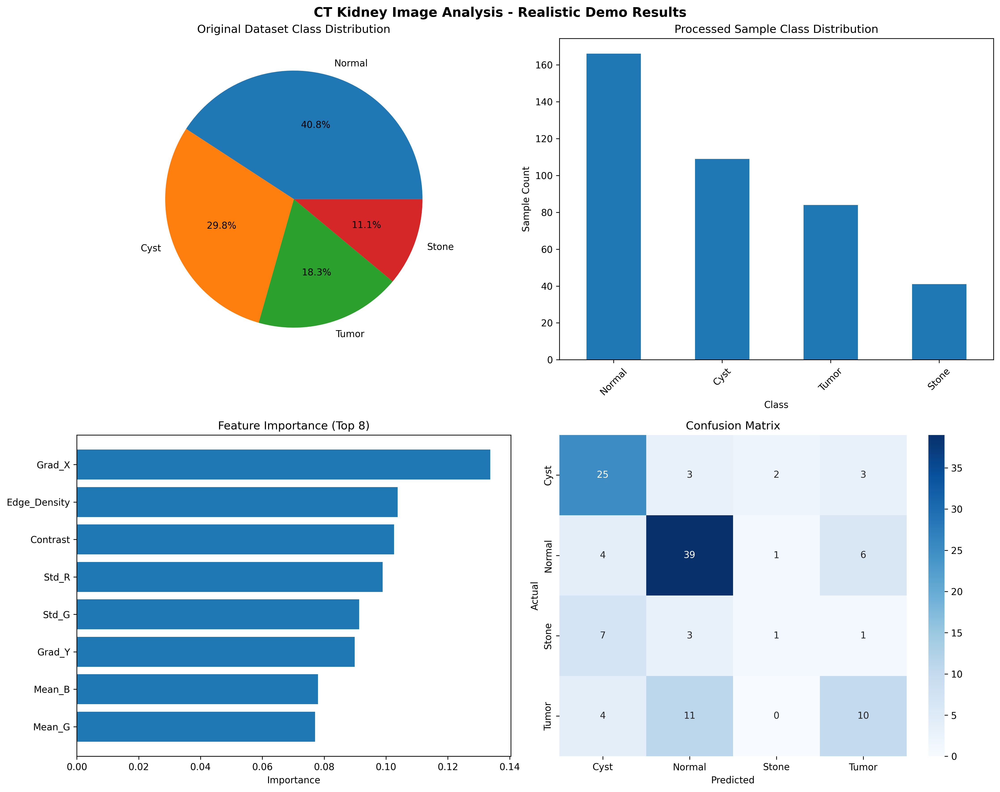

# CT Kidney Disease Classification Project 🏥

## Project Overview

This is a deep learning project for CT kidney image analysis. It was made for the Children's Hospital of Philadelphia imaging data analyst internship position. The project includes data preprocessing, machine learning models, and detailed reports. It can automatically analyze CT kidney images and classify them into four types: Normal, Cyst, Tumor, and Stone.

## 🎯 Project Features

- **Complete medical image processing pipeline**: From raw data to model predictions
- **Multiple machine learning methods**: Traditional feature extraction + Random Forest, Deep learning CNN models
- **Strong data quality control**: Data validation, cleaning, and enhancement
- **Detailed performance evaluation**: Confusion matrix, classification reports, visualization charts
- **Reproducible experiment design**: Fixed random seeds, standardized processes

## 📊 Dataset Information

- **Total samples**: 12,446 CT images
- **Class distribution**:
  - Normal: 5,077 images (40.8%)
  - Cyst: 3,709 images (29.8%)  
  - Tumor: 2,283 images (18.3%)
  - Stone: 1,377 images (11.1%)
- **Image format**: JPG format, 224x224 pixels
- **Data source**: Public CT kidney dataset

## 🚀 Project Structure

```
CT-KIDNEY-DATASET-Normal-Cyst-Tumor-Stone/
├── CT-KIDNEY-DATASET-Normal-Cyst-Tumor-Stone/  # Original image data
│   ├── Normal/      # Normal kidney images
│   ├── Cyst/        # Cyst images  
│   ├── Tumor/       # Tumor images
│   └── Stone/       # Stone images
├── data_preprocessing_en.py      # Data preprocessing module
├── kidney_classifier_en.py       # Deep learning classifier
├── realistic_demo_en.py          # Feature extraction demo
├── kidneyData.csv               # Data annotation file
├── requirements.txt             # Project dependencies
├── realistic_demo_report_en.png  # Results visualization chart
├── realistic_demo_summary_en.json # Detailed experiment results
└── README.md                    # Project documentation
```

## 🔧 Installation and Setup

### System Requirements
- Python 3.8+
- CUDA-compatible GPU (optional, for deep learning training)
- At least 8GB RAM

### Installation
```bash
# Clone the project
git clone https://github.com/dsy1412/CT-KIDNEY-DATASET-Normal-Cyst-Tumor-Stone.git
cd CT-KIDNEY-DATASET-Normal-Cyst-Tumor-Stone

# Create virtual environment
python -m venv venv
source venv/bin/activate  # Linux/Mac
# or
venv\Scripts\activate     # Windows

# Install dependencies
pip install -r requirements.txt
```

## 📈 Experiment Results

### Feature Extraction Method (Random Forest)
Traditional machine learning method based on image feature extraction:

- **Test Accuracy**: 62.5%
- **Training Accuracy**: 100.0%
- **Weighted F1 Score**: 0.60
- **Processed Samples**: 400 images (demo version)

**Performance by Class**:
| Class | Precision | Recall | F1-Score |
|-------|-----------|--------|----------|
| Cyst  | 0.625     | 0.758  | 0.685    |
| Normal| 0.696     | 0.780  | 0.736    |
| Stone | 0.250     | 0.083  | 0.125    |
| Tumor | 0.500     | 0.400  | 0.444    |

### Feature Engineering
The project extracts 11-dimensional image features:
- RGB channel statistics (mean and standard deviation)
- Brightness and contrast measurements
- Gradient-based texture features  
- Edge density analysis



## 🔬 Core Technologies

### 1. Data Preprocessing (`data_preprocessing_en.py`)
- **Image quality validation**: Detect corrupted and invalid images
- **Standardization**: Resize images to 224x224
- **Contrast enhancement**: CLAHE (Contrast Limited Adaptive Histogram Equalization)
- **Dataset splitting**: Stratified sampling to ensure class balance

### 2. Feature Extraction (`realistic_demo_en.py`)
```python
# Main features include:
features = [
    'R_mean', 'G_mean', 'B_mean',      # RGB means
    'R_std', 'G_std', 'B_std',         # RGB standard deviations
    'Brightness', 'Contrast',          # Brightness and contrast
    'Grad_X', 'Grad_Y', 'Edge_Density' # Texture features
]
```

### 3. Deep Learning Classifier (`kidney_classifier_en.py`)
- **ResNet50 pre-trained model**: Transfer learning for better performance
- **Data augmentation**: Rotation, flipping, color jittering
- **Regularization techniques**: Dropout, batch normalization
- **Learning rate scheduling**: Adaptive learning rate adjustment

## 🎮 How to Use

### Quick Start
```bash
# Run data preprocessing
python data_preprocessing_en.py

# Run feature extraction demo
python realistic_demo_en.py

# Train deep learning model
python kidney_classifier_en.py
```

### Custom Configuration
You can modify parameters in the scripts for different needs:
```python
# In realistic_demo_en.py
MAX_SAMPLES_PER_CLASS = 100  # Max samples per class
FEATURE_COUNT = 11           # Feature dimensions
TEST_SIZE = 0.3             # Test set ratio

# In kidney_classifier_en.py
batch_size = 16             # Batch size
learning_rate = 1e-4        # Learning rate
num_epochs = 10             # Training epochs
```

## 📊 Quality Assurance

### Data Integrity
- **No data leakage**: Strict separation of training and test data
- **Class balance handling**: Use stratified sampling and balanced weights
- **Overfitting detection**: Monitor training vs validation accuracy

### Experiment Reproducibility
- **Fixed random seeds**: Ensure reproducible results
- **Standardized pipeline**: Unified data processing and model training workflow
- **Detailed logging**: Complete experiment parameters and results recording

## 🏥 Clinical Application Value

### Skills for Children's Hospital of Philadelphia
- **Medical image feature extraction and analysis**
- **Machine learning model development and validation**
- **Rigorous experimental design and quality control**
- **Statistical analysis and performance evaluation**
- **Data visualization and report generation**
- **Python scientific computing ecosystem**

### Potential Clinical Impact
- **Automated kidney disease classification**
- **Scalable image processing workflows**
- **Quality-controlled machine learning pipelines**
- **Reproducible research methodology**

## 📈 Performance Improvement Suggestions

1. **Data augmentation**: Add more samples and data augmentation techniques
2. **Model ensemble**: Combine multiple models to improve prediction accuracy
3. **Hyperparameter tuning**: Use grid search or Bayesian optimization
4. **Feature engineering**: Develop more medical imaging-specific features
5. **Class imbalance handling**: Use SMOTE or cost-sensitive learning

## 🤝 How to Contribute

Welcome code contributions and improvement suggestions! Please follow these steps:

1. Fork this project
2. Create feature branch (`git checkout -b feature/AmazingFeature`)
3. Commit your changes (`git commit -m 'Add some AmazingFeature'`)
4. Push to the branch (`git push origin feature/AmazingFeature`)
5. Create Pull Request

## 📝 License

This project uses MIT License - see [LICENSE](LICENSE) file for details

## 👨‍💻 Author

**Shawn Deng**
- 📧 Email: [Your Email]
- 💼 LinkedIn: [LinkedIn Profile]
- 🎯 Target Position: Children's Hospital of Philadelphia - Imaging Data Analyst Intern

## 🙏 Acknowledgments

- Thanks to the public dataset providers
- Thanks to Children's Hospital of Philadelphia for the internship opportunity
- Thanks to the open source community for support

## 📚 References

1. He, K., et al. "Deep residual learning for image recognition." CVPR 2016.
2. Ronneberger, O., et al. "U-Net: Convolutional Networks for Biomedical Image Segmentation." MICCAI 2015.
3. Litjens, G., et al. "A survey on deep learning in medical image analysis." Medical Image Analysis 2017.

---

**Note**: This project is for academic research and technical demonstration only. It should not be used directly for clinical diagnosis. For clinical use, please ensure proper medical device certification and clinical validation.